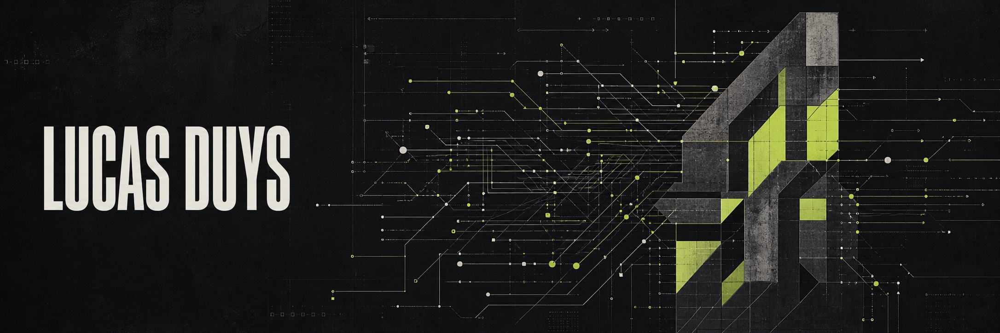

  

### BUILDING SOFTWARE FOR INTELLIGENCE UNDER CONSTRAINTS

[website](https://lucasduys.com) / [linkedin](https://www.linkedin.com/in/lucasduys) / [email](mailto:hello@lucasduys.com)

I study Computer Science at TU Eindhoven and build agent infrastructure, developer tools, and compression systems.

The interesting part starts after the demo: context is finite, tools fail, traffic arrives, and the output still has to be trusted.

## Selected systems

### [forge](https://github.com/LucasDuys/forge)

**Idea in. Reviewed code out.** A brainstorm-to-commit pipeline for Claude Code that plans, implements, tests, reviews, and commits.

### [microfiche](https://github.com/LucasDuys/microfiche)

**Context, recoded as vision.** Stores agent context as images and reads it back at up to 2.8x fewer tokens. Python package, CLI, and MCP server.

### [cinemorph](https://github.com/LucasDuys/cinemorph)

**Launch films from a brief.** A Claude Code plugin for cinematic video and pitch-deck generation with FLIP transitions, audio, MP4, and PPTX export.

### [monotoken](https://github.com/LucasDuys/monotoken)

**Planning files, about 22% smaller.** Deterministic tokenizer-aware encoding with no model calls and no broken code.

## Working set

`TypeScript` `Python` `Go` `PostgreSQL` `Docker` `Terraform`

`Claude Code` `OpenAI` `Anthropic` `MCP` `pgvector`

## More experiments

[graphbot](https://github.com/LucasDuys/graphbot) explores recursive task decomposition and temporal knowledge graphs.

[hackaway-grocery-agent](https://github.com/LucasDuys/hackaway-grocery-agent) turns one sentence into a complete Picnic cart.

If you are building tools for agents, [send me a note](mailto:hello@lucasduys.com).
